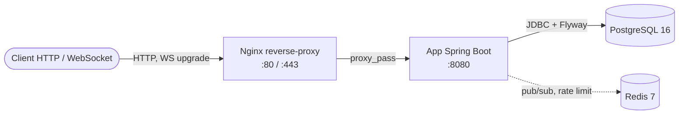

# Architecture FitTracker

> Vue d'ensemble technique du back-end. Complete `docs/twelve-factor.md` (config/logs),
> `docs/security.md` (RGPD/OWASP) et `docs/api-examples.md` (API REST).

## 1. Vue containers

Le systeme est orchestre par Docker Compose (phase 2). Nginx termine le trafic et proxifie
l'application ; PostgreSQL persiste les donnees ; Redis sert de backing service (pub/sub WebSocket
et rate limiting, phases 5-6).



## 2. Modele de donnees (ERD)

Phase 4 : persistence JPA/Hibernate sur PostgreSQL, schema gere par Flyway. Les 8 entites couvrent
les 4 types de relations exiges par le livrable.

```mermaid
erDiagram
    USERS ||--o| PROFILES : "1-1 (MapsId)"
    USERS ||--o{ TRAINING_SESSIONS : "1-N possede"
    USERS ||--o{ PROGRAMS : "1-N possede"
    USERS ||--o{ NOTIFICATIONS : "1-N recoit"
    USERS ||--o{ FOLLOWS : "follower"
    USERS ||--o{ FOLLOWS : "followee"
    TRAINING_SESSIONS ||--o{ SESSION_EXERCISES : "M-N (attributs)"
    EXERCISES ||--o{ SESSION_EXERCISES : "M-N (attributs)"

    USERS {
      uuid id PK
      varchar email "unique si actif"
      varchar password_hash
      varchar display_name
      timestamptz created_at
      timestamptz updated_at
      timestamptz deleted_at "soft-delete RGPD"
      bigint version "optimistic lock"
    }
    PROFILES {
      uuid user_id PK_FK "= users.id (MapsId)"
      int height_cm
      float weight_kg
      float goal_weight_kg
      varchar bio
    }
    EXERCISES {
      uuid id PK
      varchar name
      varchar category
      varchar muscle_group
      varchar unit
    }
    TRAINING_SESSIONS {
      uuid id PK
      uuid user_id FK
      timestamptz started_at
      int duration_seconds
      varchar type
      bigint version
    }
    SESSION_EXERCISES {
      uuid session_id PK_FK
      uuid exercise_id PK_FK
      int position PK
      int sets
      int reps
      float weight_kg
    }
    PROGRAMS {
      uuid id PK
      uuid user_id FK
      varchar name
      bigint version
    }
    FOLLOWS {
      uuid follower_id PK_FK
      uuid followee_id PK_FK
      timestamptz created_at
    }
    NOTIFICATIONS {
      uuid id PK
      uuid user_id FK
      varchar type
      jsonb payload
      timestamptz read_at
    }
```

### Les 4 types de relations (livrable 4)

| Type | Relation | Implementation |
|------|----------|----------------|
| One-to-One | `User` &harr; `Profile` | `@OneToOne` + `@MapsId` : PK partagee (profiles.user_id = users.id) |
| One-to-Many | `User` &rarr; `TrainingSession`, `Program`, `Notification` | `@ManyToOne` LAZY cote enfant, colonne FK `user_id` |
| Many-to-Many avec attributs | `TrainingSession` &harr; `Exercise` | entite d'association `SessionExercise` + `@EmbeddedId` (session_id, exercise_id, position) |
| Many-to-Many self-referencant | `User` &harr; `User` | entite `Follow` + `@EmbeddedId` (follower_id, followee_id) |

Chaque type est demontre par un test d'integration Testcontainers
(`src/test/java/com/fittracker/persistence/*IT.java`).

## 3. Choix techniques justifies

**Flyway plutot que `ddl-auto=update`.** Le schema est versionne en SQL natif et deterministe
(`V1__init.sql`, `V2__seed_exercises.sql`, `V3__seed_deleted_user.sql`). Hibernate est en
`ddl-auto=validate` : il verifie que les entites correspondent au schema, sans jamais le modifier
(brief 6.6).

**Soft-delete RGPD.** `User` porte `deleted_at` ; `@SQLDelete` transforme le `DELETE` en
`UPDATE ... SET deleted_at = now()` et `@SQLRestriction("deleted_at IS NULL")` masque
automatiquement les comptes supprimes dans toutes les requetes.

**Optimistic locking.** `@Version` (colonne `version`) sur les entites modifiables
(User, TrainingSession, Program) previent les ecrasements concurrents.

**Audit.** `@CreatedDate` / `@LastModifiedDate` + `@EnableJpaAuditing` remplissent
`created_at` / `updated_at` sans code applicatif.

**JSONB natif.** `Notification.payload` est mappe en `jsonb` via
`@JdbcTypeCode(SqlTypes.JSON)` (Hibernate 6), sans convertisseur custom.

**Pas de serialisation d'entites.** Les controllers renvoient des DTO ; l'export RGPD construit des
`Map` de valeurs scalaires a l'interieur de la transaction (`open-in-view=false`), evitant toute
`LazyInitializationException`.

## 4. Pipeline RGPD

- `GET /api/v1/users/me/export` : agrege user, profil, sessions, programmes, follows et
  notifications en JSON (droit a la portabilite).
- `DELETE /api/v1/users/me` : (1) reassigne les `training_sessions` au user sentinelle
  `00000000-0000-0000-0000-000000000000` pour conserver les agregats stats anonymement, (2) supprime
  follows, notifications et profil, (3) soft-delete le user.

## 5. Strategie de test

- Unitaires (services) : JUnit 5 + Mockito + AssertJ.
- Integration : Testcontainers Postgres 16, demarre via l'URL `jdbc:tc:postgresql:16-alpine:///`
  (profil `test`). Flyway migre le conteneur, Hibernate valide le schema. Un test par type de
  relation + un test du pipeline RGPD. Les ITs sont `@Transactional` (rollback) pour ne pas polluer
  la base partagee entre classes.
